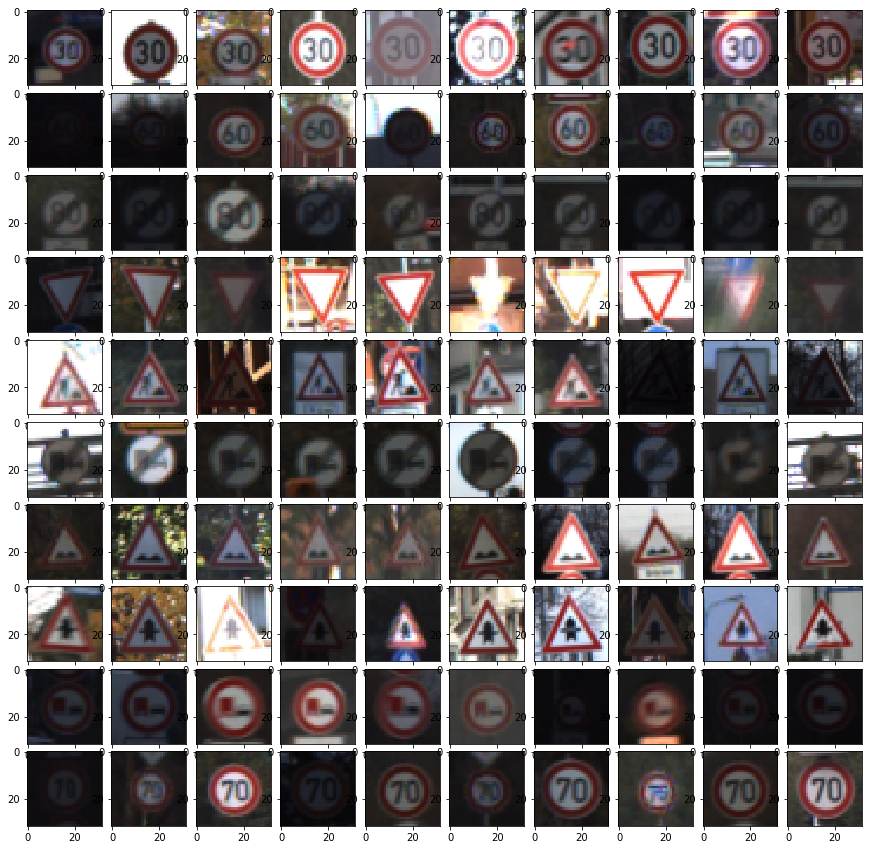
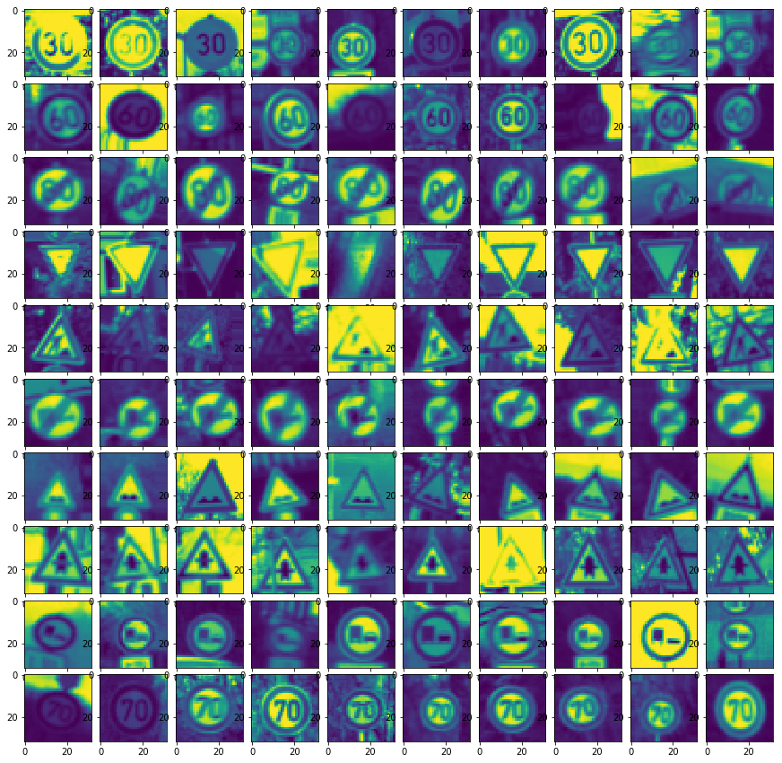
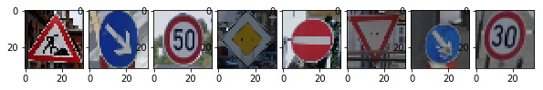

## Build a Traffic Sign Recognition Classifier for German Traffic Signs

Overview
-----

The project uses deep nueral network to classify traffic signs. [German traffic sign dataset](http://benchmark.ini.rub.de/?section=gtsrb&subsection=dataset) was used for training the nueral network. 

[Lenet-5](http://yann.lecun.com/exdb/lenet/) CNN model architecture was used for training the network. 

Dependencies
---
This lab requires:

* [CarND Term1 Starter Kit](https://github.com/udacity/CarND-Term1-Starter-Kit)

Getting Started
---

You can set up the required python library as follows:
```
conda env create -f environments-gpu.yml  # with GPU
```
If you have no CUDA-enabled GPU, you can use the following:
```
conda env create -f environments.yml  # with CPU
```
You can start the notebook as follows:
```
jupyter notebook Traffic_Sign_Classifier.ipynb
```

Model Architecture
---


| Layer         		|     Description	        					| Input |Output| 
|:---------------------:|:---------------------------------------------:| :----:|:-----:|
| Convolution     	| 1x1 stride, valid padding, RELU activation 	|32x32x1|28x28x6|
| Max pooling			| 2x2 stride, 2x2 window						|28x28x48|14x14x6|
| Convolution  	    | 1x1 stride, valid padding, RELU activation 	|14x14x6|10x10x6|
| Max pooling			| 2x2 stride, 2x2 window	   					|10x10x16|5x5x16|
| Flatten				| 3 dimensions -> 1 dimension					|5x5x16| 400|
| Fully Connected | connect every neuron from layer above			|400|120|
| Fully Connected | connect every neuron from layer above		|120|84|
| Fully Connected | number of traffic signs in data set	|84|43|

Pre-Processing Input
---

The images are converted to gray scale i.e single Y channel using Luma Coding and then normalized. Based on findings mentioned in this paper, using color channel did not improve the accuracy by much.

Normalizing the images makes it faster to train the network by ensures that each input parameter (pixel, in this case) has a similar data distribution and is not sensitive to outliers. This makes convergence faster while training the network

#### Before pre-processing 


#### After pre-processing 



Model Training
--- 

The model was trained using the following parameters 

Here are my final training parameters:

* EPOCHS = 20
* BATCH_SIZE = 128
* SIGMA = 0.1
* CONV 1 DROP OUT = 0.9
* CONV 2 DROP OUT = 0.8
* FC 1 DROP OUT = 0.7
* FC 2 DROP OUT = 0.6

Results after training the model:

* Validation Accuracy = 
* Test Accuracy = 

Test on New Images 
--- 

Images were captured from the streets of Berlin using Google Street View was used for testing and getting more insights into the working of the model.

 
